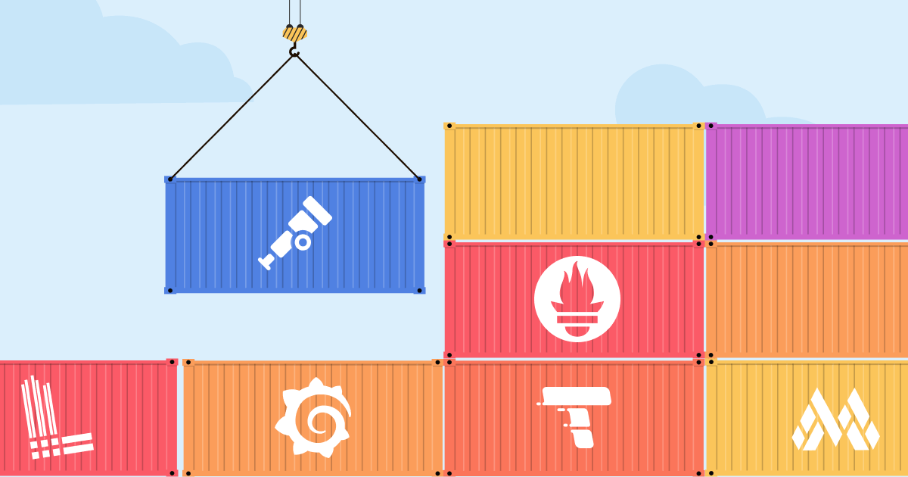
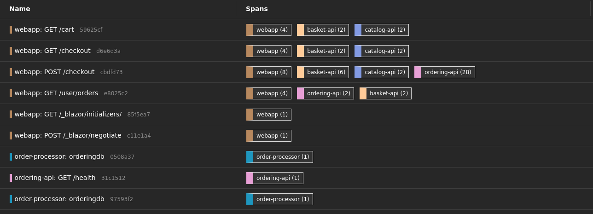

# Integrating OpenTelemetry & Security in eShop

_Assignment 02.02_


---

## Table of Contents
- [Integrating OpenTelemetry \& Security in eShop]
  - [User flow](#user-flow)
  - [Changes](#changes)
  - [How to run](#how-to-run)
    - [Prerequesits](#prerequesits)
    - [Steps](#steps)
  - [Dashboards](#dashboards)

---

## User flow

The flow I'm focusing for the purpose of this assignment is **place an order from cart**, which will affect the following **microservices**:


The workflow is as follows:
- Place items in your cart
- Go to cart
- Click on `Checkout`
- See checkout page
- Click on `Place Order`
- See the order placed under orders page

## Changes

In order to run the project with the changes I made, we first need to keep in mind 2 things: 
- I'm running the eShop solution on **Linux** (Fedora 41)
- I implemented the `observability tools` using **docker**

First, ensure that the `.NET SDK` version you are using matches the version used in the eShop project. In order to run on Fedora, I had to change the `sdk.version` on `globals.js` from `9.0.200` to `9.0.103` and trust the certificates as described [here](https://aka.ms/aspnet/https-trust-dev-cert).

Second, make sure you have Docker installed so you can run the observability tools. Make sure you have the `docker-compose.yml` file in your directory and the `obervability` directory with the config files.

## Diagram
My solution uses the following architecture:


## How to run
### Prerequesits
- [.NET SDK 9.0](https://dot.net/download?cid=eshop)
- [Docker](https://dot.net/download?cid=eshop)
- [Docker Compose](https://docs.docker.com/compose/install/)

### Steps

1. Clone the repository:
```bash
git clone https://github.com/Dan1m4D/AS-Assignment-1.git
```
2. On a separate terminal, run the docker compose:
```bash
docker compose up --build
```
3. Run the eSHop:
```bash
dotnet run --project src/eShop.AppHost/eShop.AppHost.csproj
```
4. On the terminal, you'll recieve a link to the ASPIRE dashboard:
```bash
  Login to the dashboard at https://localhost:19888/login?={some unique code}
```
5. Follow the link to see the microservices running and interact with them:
   
6. On [http://localhost:16686](http://localhost:16686) you can find the Jaeger UI
   
7. On [http://localhost:9090](http://localhost:9090) you can find the Prometheus UI
   
8. ON [http://localhost:3000](http://localhost:3000) you can find the Grafana UI
   
9.  Start using the app, mainly the use case I chose.
10. On Jaeger you can see the traces starting to come:
    
11. On Prometheus, clicking in exploring metrics, you can see the metrics collected by the `otel-collector`:
    
12. Inside Grafana, you can import the dashboards stored [here](observability/grafana/dashboards/) and see the metrics flowing.
    
## Dashboards
Here you can see the dashboards I made:


## Docs
You can find the [report](/docs/AS_1st_Assignment_Report_107603.pdf) here and the [assignment sheet](docs/02.02%20-%20Integrating%20OpenTelemetry%20&%20Security%20in%20eShop.pdf) under `/docs`