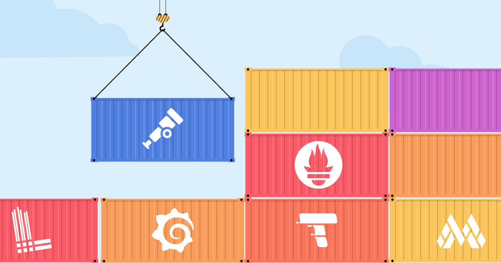
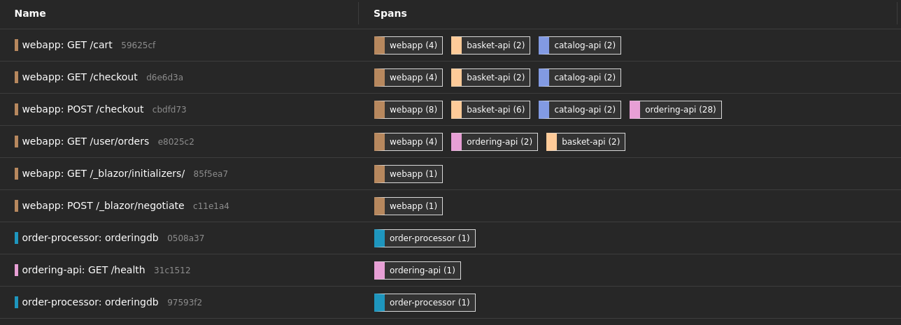

# Integrating OpenTelemetry & Security in eShop

_Assignment 02.02_

---

## Table of Contents

- [Integrating OpenTelemetry \& Security in eShop](#integrating-opentelemetry--security-in-eshop)
  - 
  - [Table of Contents](#table-of-contents)
  - [User flow](#user-flow)
  - [Changes](#changes)
  - [How to run](#how-to-run)

---

## User flow

The flow I'm focusing for the purpose of this assignment is **place an order from cart**, which will affect the following **microservices**:

## Changes

In order to run the project with the changes I made, we first need to keep in mind 2 things: 
- I'm running the eShop solution on **Linux** (Fedora 41)
- I implemented the `o-lgtm` stack using **docker**

First, ensure that the `.NET SDK` version you are using matches the version used in the eShop project. In order to run on Fedora, I had to change the `sdk.version` on `globals.js` from `9.0.200` to `9.0.103` and trust the certificates as described [here](https://aka.ms/aspnet/https-trust-dev-cert).

## How to run
